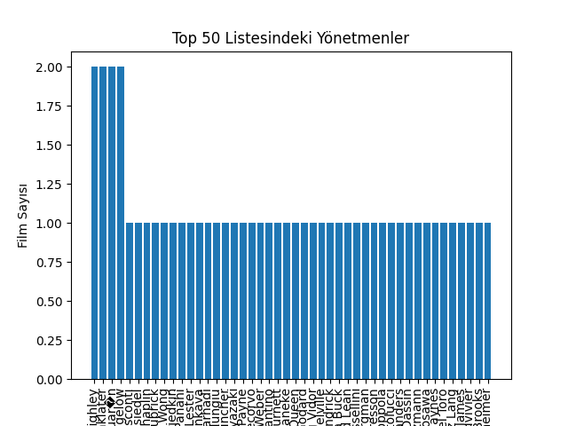
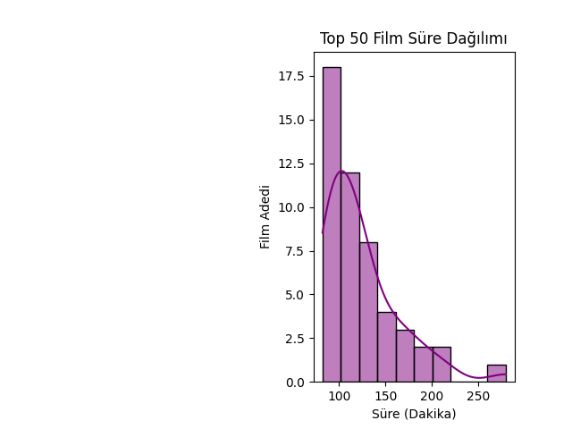

# IMDB-Analiz Projesi

Bu proje, `movies_initial.csv` adlı veri setini kullanarak IMDB filmleri üzerinde temel bir veri analizi ve görselleştirme çalışmasıdır. Projenin amacı, Pandas kütüphanesi ile veriyi işlemek ve Matplotlib/Seaborn kullanarak anlamlı görseller elde etmektir.

Analiz, özellikle "metacritic" puanına göre en iyi 50 filmi merkeze almaktadır.

## Yapılan Analizler

`main.py` scripti içerisinde aşağıdaki adımlar gerçekleştirilmiştir:

1.  **Veri Yükleme:** `movies_initial.csv` dosyası bir Pandas DataFrame'e yüklenmiştir.
2.  **Veri Temizleme:**
    * "metacritic" puanı olmayan (NaN) filmler analiz dışı bırakılmıştır.
    * "runtime" (süre) sütunundaki " min" metni kaldırılarak ve veri tipi `float`'a dönüştürülerek sayısal analiz için hazır hale getirilmiştir.
3.  **Veri İşleme:**
    * Filmler "metacritic" puanlarına göre büyükten küçüğe sıralanmıştır.
    * En yüksek puana sahip ilk 50 film seçilmiştir.
    * Bu 50 film arasında en çok filmi olan yönetmenler (`director_freq`) hesaplanmıştır.

## Görselleştirmeler

Analiz sonucunda elde edilen verilerle iki adet grafik oluşturulmuştur.

### 1. Top 50 Listesindeki Yönetmenler

Bu bar grafiği, "metacritic" puanına göre en iyi 50 film listesinde hangi yönetmenin kaç filmi olduğunu gösterir. Analiz, listedeki yönetmen çeşitliliğini ortaya koymaktadır; çoğu yönetmen 1 film ile temsil edilirken, sadece iki yönetmen listeye 2 film ile girmeyi başarmıştır.



### 2. Top 50 Film Süre Dağılımı

Bu histogram, en iyi 50 filmin sürelerinin (dakika cinsinden) dağılımını gösterir. Grafiğe göre, yüksek puanlı filmlerin çoğunluğu 100 ila 150 dakika arasında bir süreye sahiptir.



## Kullanılan Teknolojiler

* **Python 3**
* **Pandas:** Veri işleme ve temizleme için.
* **NumPy:** Sayısal hesaplamalar için.
* **Matplotlib:** Görselleştirme için.
* **Seaborn:** Görselleştirmeyi zenginleştirmek için.

## Nasıl Çalıştırılır?

1.  Bu depoyu klonlayın:
    ```bash
    git clone [https://github.com/enesbilgin0/IMDB-Analiz.git](https://github.com/enesbilgin0/IMDB-Analiz.git)
    ```
2.  Proje dizinine gidin:
    ```bash
    cd IMDB-Analiz
    ```
3.  Gerekli kütüphaneleri yükleyin:
    ```bash
    pip install pandas numpy matplotlib seaborn
    ```
4.  Python script'ini çalıştırın:
    ```bash
    python main.py
    ```
